## Web Dinamis
Sebuah situs web dinamis adalah situs web yang menampilkan konten yang dapat berubah secara dinamis berdasarkan interaksi pengguna, waktu, atau data yang diperbarui. Artinya, konten tidak statis; itu bisa berubah tergantung pada berbagai faktor seperti input pengguna, permintaan server, atau data terbaru dari database.
## PHP
PHP (Hypertext Preprocessor) adalah bahasa pemrograman yang sering digunakan untuk mengembangkan situs web dinamis. PHP adalah bahasa pemrograman sisi server, yang berarti kode PHP dijalankan pada server web sebelum hasilnya dikirim ke browser pengguna. Ini memungkinkan pengembang untuk membuat situs web yang dinamis dengan mudah, karena PHP memungkinkan untuk berinteraksi dengan database, mengelola formulir, membuat halaman web dinamis, dan melakukan banyak tugas lainnya untuk memproses data dan membangun konten yang disesuaikan secara dinamis. PHP sangat populer di kalangan pengembang web karena kemampuannya yang kuat, fleksibilitas, dan kemudahan dalam belajar dan digunakan.


# Program Pertama
## kode program
```php
<?php

  

//dibawah ini berfungsi untuk menampilkan

/*

ini

komentar multi bari

*/

$meja = 30;

$tk_kelas = "XI";

$ketua_kelas = "جولي";

$wali_kelas = "صالح";

$ketua_gank = "عبد الرحمن";

$ketua_gank = "Rahmat"; //pengubahan nilai variabel

  

//konstanta

const KEPSEK = "HERWELIS";

define('kelas' , 'RPL 1');

  

/*kutip satu hanya membaca string, variabel dan string

dipisahkan dengan tanda titik */

echo 'jumlah meja di kelas: '. $meja . 'buah';

echo "<br>";

  

//kutip dua bisa membaca nilai dari sebuah variabel

echo "Sholat dlu, nabilang Pak $wali_kelas dan $ketua_kelas     ketua kelas";

echo "<br>";

  

///kutip satu dibaca string disini

echo "Kalau tidak, diracca` sama ketua gank $ketua_gank";

echo "<br>";

  

echo 'Kepseknya ' . KEPSEK;

echo "<br>";

echo 'kelasnya ' . $tk_kelas . ' ' . kelas; 
```

## Penjelasan
1. **Variabel**:
    - Variabel digunakan untuk menyimpan data. Contohnya adalah `$meja`, `$tk_kelas`, `$ketua_kelas`, `$wali_kelas`, dan `$ketua_gank`.
    - Pada baris `$ketua_gank = "Rahmat";`, nilai dari variabel `$ketua_gank` diubah dari `"عبد الرحمن"` menjadi `"Rahmat"`.
2. **Komentar**:
    - Komentar digunakan untuk memberikan penjelasan atau dokumentasi pada kode. Ada dua jenis komentar yang digunakan:
        - Komentar dalam bentuk `//`, yang berfungsi untuk memberikan komentar pada satu baris.
        - Komentar dalam bentuk `/* */`, yang berfungsi untuk memberikan komentar pada beberapa baris sekaligus.
3. **Konstanta**:
    - Konstanta didefinisikan menggunakan kata kunci `const` atau `define()`. Contohnya adalah `const KEPSEK = "HERWELIS";` dan `define('kelas' , 'RPL 1');`.
    - Konstanta bersifat tetap dan nilainya tidak dapat diubah setelah didefinisikan.
4. **Menampilkan Output**:
    - Fungsi `echo` digunakan untuk menampilkan output ke layar.
    - Pada beberapa baris, nilai dari variabel digabungkan dengan string menggunakan operator `.` untuk ditampilkan dalam output.
    - Perbedaan antara penggunaan kutip satu (`'`) dan kutip dua (`"`) adalah kutip dua memungkinkan penggunaan interpolasi string, di mana nilai variabel bisa langsung dimasukkan ke dalam string tanpa harus dipisahkan dengan operator `.`.
5. **Output Program**:
    - Program ini akan menampilkan beberapa baris teks yang mencakup nilai dari variabel dan konstanta yang telah didefinisikan sebelumnya, serta beberapa teks tambahan.

## Hasil
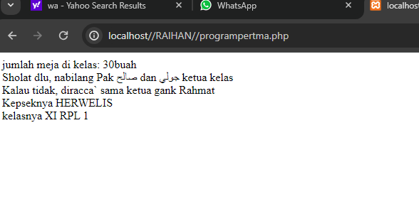

## Kesimpulan
Program PHP tersebut menggunakan variabel untuk menyimpan data seperti jumlah meja, kelas, nama-nama individu, dan konstanta untuk menyimpan informasi yang nilainya tetap. Komentar digunakan untuk memberikan penjelasan pada bagian-bagian kode. Program ini kemudian menampilkan output yang menggabungkan nilai variabel dan konstanta dengan teks tambahan menggunakan fungsi `echo`.

Dengan demikian, kesimpulannya adalah bahwa program ini merupakan contoh penggunaan dasar variabel, konstanta, komentar, dan fungsi `echo` dalam bahasa pemrograman PHP untuk menampilkan informasi ke layar.

# PHP Dasar
## Echo & Comentar
### Echo
Dalam konteks PHP, "echo" adalah perintah yang digunakan untuk menampilkan teks atau variabel ke dalam halaman web. Ini adalah cara umum untuk menghasilkan output dalam PHP. Misalnya, jika Anda ingin menampilkan pesan sederhana seperti "Hello, world!" di halaman web, Anda dapat menggunakan perintah "echo":

```php
echo "Hello, world!";

```
Perintah ini akan menampilkan "Hello, world!" di halaman web ketika halaman tersebut dimuat.

### Comentar
Sementara itu, "commentar" (komentar) adalah bagian dari kode yang tidak dieksekusi oleh server web. Mereka digunakan untuk memberikan penjelasan atau dokumentasi di dalam kode, atau untuk menonaktifkan sementara potongan kode tertentu tanpa menghapusnya sepenuhnya. Di PHP, ada dua jenis komentar:

1. Komentar satu bar: Untuk menulis komentar satu bar, Anda bisa menggunakan dua garis miring (`//`) diikuti oleh teks komentar. Kode di bawah ini adalah contoh komentar satu bar:

```php
// Ini adalah komentar satu bar

```

2. Komentar multi-baris: Untuk menulis komentar multi-baris, Anda dapat menggunakan tanda `/*` untuk memulai komentar dan `*/` untuk mengakhiri komentar. Semua teks di antara tanda tersebut akan dianggap sebagai komentar. Berikut adalah contoh komentar multi-baris:

```php
/*
Ini adalah
komentar multi-baris
*/

```

Komentar berguna untuk menjelaskan fungsi atau alur kerja dari potongan kode, dan dapat membantu pengembang lain dalam memahami kode yang ditulis. Komentar tidak akan ditampilkan di halaman web dan tidak akan memengaruhi kinerja kode PHP.

## variable & const
### Variable
Dalam pemrograman, "variabel" adalah suatu tempat di mana Anda bisa menyimpan nilai. Ini seperti sebuah kotak di mana Anda dapat menaruh berbagai jenis data, seperti angka, string teks, atau objek, dan Anda dapat mengaksesnya kapan pun Anda butuhkan. Variabel biasanya diberi nama yang menggambarkan nilainya untuk memudahkan penggunaan di dalam kode.

Contoh penggunaan variabel dalam PHP:
```php
$nama = "John"; // variabel $nama menyimpan string "John"
$umur = 25; // variabel $umur menyimpan angka 25

```

### Const
Selain variabel, dalam PHP Anda juga memiliki "konstanta" atau "const". Konstanta adalah seperti variabel tetapi nilainya tidak berubah selama jalannya program. Mereka biasanya didefinisikan dengan huruf besar dan dapat diakses di seluruh program PHP. Anda mendefinisikan konstanta menggunakan fungsi `define()`.

Contoh penggunaan konstanta dalam PHP:
```php
define("PI", 3.14); // Konstanta PI dengan nilai 3.14
echo PI; // Output: 3.14

```


## Operator

**Operator**: Operator digunakan untuk melakukan operasi pada variabel dan nilai. Ada berbagai jenis operator dalam pemrograman seperti operator aritmatika, operator perbandingan, dan operator logika. Beberapa operator dasar dalam PHP meliputi:

### Operator Aritmatika

#### Pemjumlahan

- **Penjelasan:**

    Penjumlahan (+): Digunakan untuk menambahkan dua nilai bersama-sama

```php

$nilai1 = 10;

$nilai2 = 5;

  

$penjumlahan = $nilai1 + $nilai2;

echo "Penjumlahan: " . $penjumlahan . "<br>";

```

```output

Penjumlahan: 15

```

- **Analisis**

    Penjumlahan (+):

    - Operator ini digunakan untuk menambahkan dua nilai bersama-sama.

    - Contoh: `$penjumlahan = $nilai1 + $nilai2;`

    - Hasilnya adalah penjumlahan dari nilai `$nilai1` dan `$nilai2`.

- **Kesimpulan**

    - Kesimpulannya, dengan operator ini, kita dapat menambahkan nilai-nilai numerik dalam PHP dengan mudah.

___

#### Pengurangan

- **Penjelasan:**

    Pengurangan (-): Digunakan untuk mengurangkan nilai kedua dari nilai pertama.

```php

$nilai1 = 10;

$nilai2 = 5;

  

$pengurangan = $nilai1 - $nilai2;

echo "Pengurangan: " . $pengurangan . "<br>";

```

```output

Pengurangan: 5

```

- **Analisis**

    Pengurangan (-):

    - Operator ini digunakan untuk mengurangkan nilai kedua dari nilai pertama.

    - Contoh: `$pengurangan = $nilai1 - $nilai2;`

    - Hasilnya adalah pengurangan dari nilai `$nilai2` dari `$nilai1`.

- **Kesimpulan**

    - Kesimpulannya, penggunaan operator ini memungkinkan kita untuk mengurangkan satu nilai dari yang lain dalam pemrograman PHP.

___

#### Perkalian

- **Penjelasan**

    Perkalian (*): Digunakan untuk mengalikan dua nilai bersama-sama.

```php

$nilai1 = 10;

$nilai2 = 5;

$perkalian = $nilai1 * $nilai2;

echo "Perkalian: " . $perkalian . "<br>";

```

```output

Perkalian: 50

```

- **Analisis**

    Perkalian (*):

    - Operator ini digunakan untuk mengalikan dua nilai bersama-sama.

    - Contoh: `$perkalian = $nilai1 * $nilai2;`

    - Hasilnya adalah perkalian dari `$nilai1` dan `$nilai2`.

- **Kesimpulan**

    - Kesimpulannya, dengan operator ini, kita dapat melakukan perkalian nilai-nilai numerik dalam PHP untuk mendapatkan hasil perkalian.

___

#### Pembagian

- Penjelasan

    Pembagian (/): Digunakan untuk membagi nilai pertama dengan nilai kedua.

```php

$nilai1 = 10;

$nilai2 = 5;

  

$pembagian = $nilai1 / $nilai2;

echo "Pembagian: " . $pembagian . "<br>";

```

```output

Pembagian: 2

```

- **Analisis**

    Pembagian (/):

    - Operator ini digunakan untuk membagi nilai pertama dengan nilai kedua.

    - Contoh: `$pembagian = $nilai1 / $nilai2;`

    - Hasilnya adalah pembagian dari nilai `$nilai1` dengan `$nilai2`.

- **Kesimpulan**

    - Kesimpulannya, operator ini memungkinkan kita untuk membagi nilai-niai numerik dalam PHP dan mendapatkan hasil pembagian.

___

#### Modulus

- Penjelasan

    Modulus (%): Digunakan untuk mengembalikan sisa pembagian dari nilai pertama dengan nilai kedua.

```php

$nilai1 = 10;

$nilai2 = 5;

  

$modulus = $nilai1 % $nilai2;

echo "Modulus: " . $modulus . "<br>";

```

```output

Modulus: 0

```

- **Analisis**

    Modulus (%):

    - Operator ini digunakan untuk mengembalikan sisa pembagian dari nilai pertama dengan nilai kedua.

    - Contoh: `$modulus = $nilai1 % $nilai2;`

    - Hasilnya adalah sisa pembagian dari `$nilai1` dengan `$nilai2`.

- **Kesimpulan**

    - Kesimpulannya, dengan menggunakan operator modulus, kita dapat menghitung sisa pembagian dari nilai-nilai numerik dalam PHP.

___

### Operator Perbandingan

- **Penjelasan**

    1. Operator Sama dengan (== ):

     Operator ini digunakan untuk membandingkan apakah dua nilai sama.

     Contohnya, `$a == $b` akan menghasilkan true jika nilai variabel `$a` sama dengan nilai variabel `$b`, dan false jika tidak sama.

  

    2. Operator Tidak Sama dengan (!=):

     Operator ini digunakan untuk membandingkan apakah dua nilai tidak sama.

     Contohnya, `$a != $b` akan menghasilkan true jika nilai variabel `$a` tidak sama dengan nilai variabel `$b`, dan false jika sama.

  

    3. Operator Kurang dari (<):

     Operator ini digunakan untuk membandingkan apakah nilai kiri kurang dari nilai kanan.

     Contohnya, `$a < $b` akan menghasilkan true jika nilai variabel `$a` kurang dari nilai variabel `$b`, dan false jika tidak kurang dari.

  

    4. Operator Lebih Besar dari (>):

     Operator ini digunakan untuk membandingkan apakah nilai kiri lebih besar dari nilai kanan.

     Contohnya, `$a > $b` akan menghasilkan true jika nilai variabel `$a` lebih besar dari nilai variabel `$b`, dan false jika tidak lebih besar dari.

  

    5. Operator Kurang dari atau Sama dengan (<=):  

     Operator ini digunakan untuk membandingkan apakah nilai kiri kurang dari atau sama dengan nilai kanan.

     Contohnya, `$a <= $b` akan menghasilkan true jika nilai variabel `$a` kurang dari atau sama dengan nilai variabel `$b`, dan false jika tidak kurang dari atau sama dengan.

  

    6. Operator Lebih Besar dari atau Sama dengan (>=):  

     Operator ini digunakan untuk membandingkan apakah nilai kiri lebih besar dari atau sama dengan nilai kanan.

     Contohnya, `$a >= $b` akan menghasilkan true jika nilai variabel `$a` lebih besar dari atau sama dengan nilai variabel `$b`, dan false jika tidak lebih besar dari atau sama dengan.

- **Kode Program**

```php

<?php

$a = 5;

$b = 10;

  

// Operator sama dengan (==)

if ($a == $b) {

    echo "$a sama dengan $b";

} else {

    echo "$a tidak sama dengan $b";

}

echo "<br>";

  
  

// Operator tidak sama dengan (!=)

if ($a != $b) {

    echo "$a tidak sama dengan $b";

} else {

    echo "$a sama dengan $b";

}

echo "<br>";

  
  

// Operator kurang dari (<)

if ($a < $b) {

    echo "$a kurang dari $b";

} else {

    echo "$a tidak kurang dari $b";

}

echo "<br>";

  
  

// Operator lebih besar dari (>)

if ($a > $b) {

    echo "$a lebih besar dari $b";

} else {

    echo "$a tidak lebih besar dari $b";

}

echo "<br>";

  
  

// Operator kurang dari atau sama dengan (<=)

if ($a <= $b) {

    echo "$a kurang dari atau sama dengan $b";

} else {

    echo "$a tidak kurang dari atau sama dengan $b";

}

echo "<br>";

  
  

// Operator lebih besar dari atau sama dengan (>=)

if ($a >= $b) {

    echo "$a lebih besar dari atau sama dengan $b";

} else {

    echo "$a tidak lebih besar dari atau sama dengan $b";

}

?>

```

```output

5 tidak sama dengan 10

  

5 tidak sama dengan 10

  

5 kurang dari 10

  

5 tidak lebih besar dari 10

  

5 kurang dari atau sama dengan 10

  

5 tidak lebih besar dari atau sama dengan 10

  

```

- **Analisis**

    - Dua variabel `$a` dan `$b` diinisialisasi dengan nilai numerik, masing-masing 5 dan 10.

    - Program kemudian membandingkan `$a` dan `$b` menggunakan berbagai operator perbandingan dan menampilkan pesan berdasarkan hasil perbandingan.

    - Karena `$a` (5) tidak sama dengan `$b` (10), maka pesan "5 tidak sama dengan 10" akan ditampilkan.

    - Karena `$a` (5) kurang dari `$b` (10), maka pesan "5 kurang dari 10" akan ditampilkan.

    - Karena `$a` (5) tidak lebih besar dari `$b` (10), maka pesan "5 tidak lebih besar dari 10" akan ditampilkan.

    - Karena `$a` (5) kurang dari atau sama dengan `$b` (10), maka pesan "5 kurang dari atau sama dengan 10" akan ditampilkan.

    - Karena `$a` (5) tidak lebih besar dari atau sama dengan `$b` (10), maka pesan "5 tidak lebih besar dari atau sama dengan 10" akan ditampilkan.

- **Kesimpulan**

    - Program ini membantu memahami cara kerja operator perbandingan dalam PHP.

    - Operator perbandingan digunakan untuk membandingkan nilai dan mengontrol alur program berdasarkan hasil perbandingan.

    - Program seperti ini bermanfaat dalam logika pemrograman untuk membuat keputusan berdasarkan kondisi tertentu.

### Operator Logika

- **Penjelasan**

    Dalam PHP, operator logika digunakan untuk menggabungkan kondisi logis dan menghasilkan nilai boolean (true atau false) berdasarkan kebenaran kondisi tersebut. Contoh operator:

    1. **AND (&&):** Menghasilkan true jika kedua kondisi benar.

    2. **OR (||):** Menghasilkan true jika salah satu atau kedua kondisi benar.

    3. **NOT (!):** Membalikkan nilai kondisi, true menjadi false, dan sebaliknya.

```php

<?php

$a = 5;

$b = 10;

$c = 15;

  

// Operator logika AND (&&)

if ($a < $b && $b < $c) {

    echo "$a kurang dari $b dan $b kurang dari $c";

} else {

    echo "Kondisi AND tidak terpenuhi";

}

echo "<br>";

  

// Operator logika OR (||)

if ($a > $b || $b > $c) {

    echo "$a lebih besar dari $b atau $b lebih besar dari $c";

} else {

    echo "Kondisi OR tidak terpenuhi";

}

echo "<br>";

  

// Operator logika NOT (!)

if (!($a == $b)) {

    echo "$a tidak sama dengan $b";

} else {

    echo "$a sama dengan $b";

}

?>

  

```

```output

5 kurang dari 10 dan 10 kurang dari 15

  

Kondisi OR tidak terpenuhi

  

5 tidak sama dengan 10

```

- **Anlisis**

    - Kita memiliki tiga variabel `$a`, `$b`, dan `$c` dengan nilai 5, 10, dan 15.

    - Operator logika `AND` digunakan untuk memeriksa apakah `$a` kurang dari `$b` dan `$b` kurang dari `$c`. Jika  keduanya benar, pesan yang sesuai ditampilkan.

    - Operator logika `OR` digunakan untuk memeriksa apakah `$a` lebih besar dari `$b` atau `$b` lebih besar dari `$c`. Jika salah satu atau kedua kondisi benar, pesan yang sesuai ditampilkan.

    - Operator logika `NOT` digunakan untuk membalikkan nilai kondisi `$a` == `$b`. Jika `$a` tidak sama dengan `$b`, pesan yang sesuai ditampilkan.

- **Kesimpulan**

    - Kode ini menggunakan operator logika untuk membuat keputusan berdasarkan kondisi-kondisi yang dievaluasi.

    - Operator logika memungkinkan kita untuk menggabungkan kondisi-kondisi logis dan mengontrol alur program berdasarkan kebenaran kondisi tersebut.

    - Dengan menggunakan operator logika, kita dapat membuat program yang lebih kompleks dengan logika yang bergantung pada kondisi-kondisi tertentu.
## Conditional statement
### IF
#### Penjelasan
Pernyataan kondisional "if" dalam bahasa pemrograman PHP digunakan untuk membuat keputusan berdasarkan kondisi tertentu. Dengan menggunakan "if", Anda dapat mengontrol aliran eksekusi program berdasarkan kebenaran atau kevalidan dari suatu kondisi.

Berikut adalah sintaks dasar dari pernyataan kondisional "if" dalam PHP:
```php
if (kondisi) {
    // Blok kode yang akan dieksekusi jika kondisi benar
```
- Jika `kondisi` dievaluasi sebagai benar, maka blok kode di dalam kurung kurawal `{}` setelah pernyataan "if" akan dieksekusi.

#### Struktur
```php
<?php

$variable = nilai_variable;

  

if ($variable >= nilai_variable) {

    echo "output_yang_ditampilkan";

}

?>
```
#### Program
```php
<?php

$umur = 25;

  

if ($umur >= 18) {

    echo "Anda sudah cukup umur.";

}

?>
```
#### Hasil 
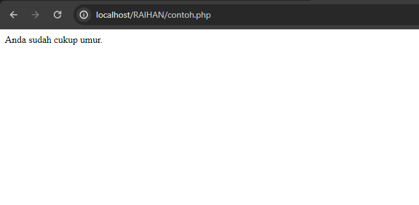
#### Analisis
1. Program tersebut menggunakan struktur kontrol if untuk melakukan pengecekan kondisi tertentu.
2. Variabel `$umur` diinisialisasi dengan nilai 25.
3. Dalam blok if, program memeriksa apakah nilai `$umur` lebih besar dari atau sama dengan 18.
4. Jika kondisi tersebut terpenuhi (nilai `$umur` lebih besar dari atau sama dengan 18), maka program akan mencetak pesan "Anda sudah cukup umur.".
5. Jika kondisi tersebut tidak terpenuhi (nilai `$umur` kurang dari 18), tidak ada output yang dihasilkan.
#### Kesimpulan Program
Program PHP di atas adalah contoh sederhana penggunaan kondisional if dalam bahasa pemrograman PHP. Ini adalah program singkat yang menetapkan sebuah variabel `$umur` dengan nilai 25, dan kemudian memeriksa apakah nilai variabel tersebut lebih besar dari atau sama dengan 18. Jika ya, maka pesan "Anda sudah cukup umur." akan dicetak.

Jadi, jika nilai `$umur` adalah 25 atau lebih, maka outputnya akan menjadi "Anda sudah cukup umur.". Jika nilai `$umur` kurang dari 18, maka tidak akan ada output yang dicetak.

Program ini digunakan untuk memberikan pesan berdasarkan kondisi tertentu, dalam hal ini, memberikan pesan kepada pengguna bahwa mereka sudah cukup umur jika umurnya 18 tahun atau lebih.


### IF-else
#### Penjelasan
Dalam bahasa pemrograman PHP, struktur pengendali `if-else` digunakan untuk membuat keputusan berdasarkan kondisi tertentu. Ini memungkinkan program untuk mengeksekusi kode yang berbeda tergantung pada apakah suatu kondisi itu benar (true) atau salah (false).

Berikut adalah penjelasan tentang `if-else` di PHP:

**else**: Ini adalah bagian opsional yang dapat ditambahkan setelah if. Jika kondisi dalam if tidak terpenuhi (false), maka blok kode di dalam else akan dieksekusi.
Contoh:
```php
$umur = 15;
if ($umur >= 18) {
    echo "Anda sudah cukup umur.";
} else {
    echo "Anda belum cukup umur.";
}

```
#### Struktur
```php
<?php

Variable = Nilai_variable;

  

if(Variable >= Nilai_variable){

    echo "output_yang_ditampilkan";

} else {

    echo "output_yang_ditampilkan";

}

?>

```
#### Program
```php
<?php

$nilai = 80;

  

if($nilai >= 75){

    echo "Nilai Anda Baik!";

} else {

    echo "Maaf, Anda kenak remedial.";

}

?>
```
#### Hasil 
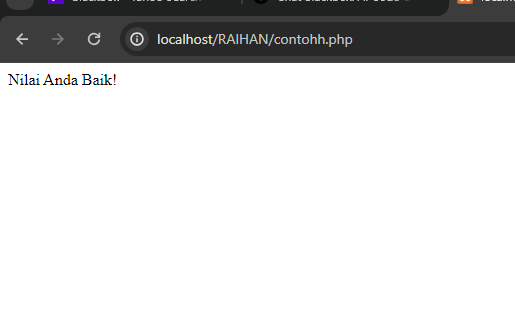
#### Analisis
Program PHP di atas adalah contoh sederhana dari penggunaan struktur kontrol if-else untuk mengevaluasi nilai dari variabel `$nilai` dan memberikan respons berdasarkan nilai tersebut. Di sini, variabel `$nilai` diatur ke nilai 80.

Analisis program ini adalah sebagai berikut:

1. **Inisialisasi Variabel**: Variabel `$nilai` diinisialisasi dengan nilai 80.

2. **Pengecekan Kondisi**: Dalam blok if, kondisi dievaluasi. Jika nilai dari variabel `$nilai` lebih besar atau sama dengan 75, maka pesan "Nilai Anda Baik!" akan dicetak. Jika tidak, maka program akan masuk ke blok else.

3. **Output**: Jika kondisi di blok if terpenuhi (nilai `$nilai` lebih besar atau sama dengan 75), maka pesan "Nilai Anda Baik!" akan dicetak. Jika tidak, maka pesan "Maaf, Anda kenak remedial." akan dicetak.

Dalam hal ini, karena nilai `$nilai` adalah 80, yang lebih besar dari 75, maka output yang akan dihasilkan adalah "Nilai Anda Baik!". Jadi, program memberikan respons positif berdasarkan nilai yang diberikan.
#### Kesimpulan Program
Kesimpulannya, program memberikan respons berdasarkan nilai yang diberikan, memberikan apresiasi ketika nilai mencapai atau melebihi batas tertentu, dan memberikan peringatan ketika nilai di bawah batas tersebut.
### if-else if-else
#### Penjelasan
Struktur kontrol `if-else-if-else` digunakan untuk mengevaluasi beberapa kondisi secara berurutan. Dalam konteks PHP, struktur ini memungkinkan Anda untuk memeriksa beberapa kondisi dan menjalankan blok kode yang sesuai dengan kondisi yang terpenuhi pertama kali.

Berikut adalah penjelasan tentang `if-else-if-else`:

1. **if**: Blok pertama dari struktur ini, di mana Anda menentukan kondisi pertama yang ingin Anda periksa. Jika kondisi ini terpenuhi (true), blok kode dalam if akan dieksekusi.
    
2. **else if**: Ini adalah bagian opsional yang dapat digunakan setelah if. Jika kondisi dalam if tidak terpenuhi, maka kondisi dalam else if akan diperiksa. Jika kondisi else if ini terpenuhi, blok kode di dalamnya akan dieksekusi.
    
3. **else**: Blok terakhir dari struktur, yang akan dieksekusi jika tidak ada kondisi di dalam if atau else if yang terpenuhi. Ini bersifat opsional dan bisa ada atau tidak.
#### Struktur
```php
<?php

Variable = nilai_variable;

  

if (Variable >= nilai_variable) {

    echo "output_yang_ditampilkan";

} elseif (Variable  >= nilai_variable) {

    echo "output_yang_ditampilkan";

} elseif (Variable >= nilai_variable) {

    echo "output_yang_ditampilkan";

} else {

    echo "output_yang_ditampilkan";

}

?>
```
#### Program
```php
<?php

$nilai = 90;

  

if ($nilai >= 90) {

    echo "Nilai Anda sangat baik!";

} elseif ($nilai >= 80) {

    echo "Nilai Anda baik.";

} elseif ($nilai >= 70) {

    echo "Anda mendapat nilai cukup.";

} else {

    echo "Maaf, Anda kenak remedial.";

}

?>
```
#### Hasil 

#### Analisis
Analisis program ini adalah sebagai berikut:

1. **Inisialisasi Variabel**: Variabel `$nilai` diinisialisasi dengan nilai 90.
    
2. **Pengecekan Kondisi**: Program mengevaluasi nilai dari variabel `$nilai` menggunakan struktur `if-else-if-else`.
    
    - Jika nilai `$nilai` lebih besar atau sama dengan 90, maka pesan "Nilai Anda sangat baik!" akan dicetak.
    - Jika nilai `$nilai` lebih besar atau sama dengan 80 (tetapi kurang dari 90), maka pesan "Nilai Anda baik." akan dicetak.
    - Jika nilai `$nilai` lebih besar atau sama dengan 70 (tetapi kurang dari 80), maka pesan "Anda mendapat nilai cukup." akan dicetak.
    - Jika nilai `$nilai` kurang dari 70, maka pesan "Maaf, Anda kenak remedial." akan dicetak.
3. **Output**: Karena nilai `$nilai` adalah 90, yang lebih besar atau sama dengan 90, maka pesan "Nilai Anda sangat baik!" akan dicetak.
#### Kesimpulan Program
- Program menggunakan struktur kontrol `if-else-if-else` untuk mengevaluasi nilai dari variabel `$nilai` dan memberikan respons berdasarkan rentang nilai yang terpenuhi.
- Rentang nilai yang dinilai dimulai dari nilai tertinggi ke nilai terendah, yaitu 90 ke 70.
-  Program memberikan respons yang sesuai dengan rentang nilai yang terpenuhi pertama kali.
- Dalam hal ini, karena nilai yang diberikan adalah 90, yang memenuhi kondisi pertama, maka pesan "Nilai Anda sangat baik!" akan dicetak.
- Pesan yang dicetak sesuai dengan kondisi yang terpenuhi, menunjukkan apresiasi terhadap nilai yang tinggi.
- Program ini dapat dengan mudah diubah untuk menangani lebih banyak rentang nilai atau kondisi tambahan sesuai kebutuhan.
### Switch-case
#### Penjelasan
Struktur kontrol `switch-case` dalam PHP digunakan untuk memeriksa nilai satu variabel atau ekspresi terhadap serangkaian nilai yang mungkin. Ini adalah alternatif yang lebih bersih dan terstruktur dibandingkan dengan menggunakan serangkaian pernyataan `if-else` berturut-turut.
#### Struktur
```php
<?php
Variable = "nilai_variable_yang_ingin_ditampilkan";

switch (Variable) {
    case "nilai_variable":
        echo "output_yang_ditampilkan";
        break;
    case "nilai_variable":
        echo "output_yang_ditampilkan";
        break;
    case "nilai_variable":
        echo "output_yang_ditampilkan";
        break;
    default:
        echo "output_yang_ditampilkan";
}
?>
```
#### Program
```php
<?php
$hari = "Selasa";

switch ($hari) {
    case "Senin":
        echo "Hari ini adalah hari Senin.";
        break;
    case "Selasa":
        echo "Hari ini adalah hari Selasa.";
        break;
    case "Rabu":
        echo "Hari ini adalah hari Rabu.";
        break;
    default:
        echo "Hari ini adalah hari lainnya.";
}
?>

```
#### Hasil 

#### Analisis
Program PHP di atas menggunakan struktur `switch-case` untuk mengevaluasi nilai variabel `$hari` dan memberikan respons berdasarkan nilai tersebut. Variabel `$hari` diatur ke nilai "Selasa".

Analisis program ini adalah sebagai berikut:

1. **Inisialisasi Variabel**: Variabel `$hari` diinisialisasi dengan nilai "Selasa".
    
2. **Pengecekan Kondisi**: Program menggunakan struktur `switch-case` untuk mengevaluasi nilai variabel `$hari`.
    
    - Jika nilai `$hari` adalah "Senin", maka pesan "Hari ini adalah hari Senin." akan dicetak.
    - Jika nilai `$hari` adalah "Selasa", maka pesan "Hari ini adalah hari Selasa." akan dicetak.
    - Jika nilai `$hari` adalah "Rabu", maka pesan "Hari ini adalah hari Rabu." akan dicetak.
    - Jika nilai `$hari` tidak cocok dengan semua nilai case yang ada, maka blok kode di dalam default akan dieksekusi.
3. **Output**: Karena nilai variabel `$hari` adalah "Selasa", maka pesan "Hari ini adalah hari Selasa." akan dicetak.
#### Kesimpulan Program
- Program menggunakan struktur kontrol `switch-case` untuk mengevaluasi nilai dari variabel `$hari` dan memberikan respons berdasarkan nilai tersebut.
-  Setiap `case` dalam struktur `switch` menentukan nilai-nilai yang mungkin untuk variabel yang dievaluasi.
-  Jika nilai variabel `$hari` cocok dengan salah satu nilai case yang ada, maka blok kode yang sesuai dengan case tersebut akan dieksekusi.
- Jika nilai variabel `$hari` tidak cocok dengan semua nilai case yang ada, maka blok kode di dalam `default` akan dieksekusi.
-  Dalam kasus program di atas, karena nilai variabel `$hari` adalah "Selasa", maka pesan "Hari ini adalah hari Selasa." akan dicetak.
- `Switch-case` memberikan cara yang efisien dan bersih untuk menangani serangkaian kondisi yang mungkin berbeda berdasarkan nilai dari satu variabel atau ekspresi.
## Array
### Array 1 dimensi
#### Penjelasan
Array satu dimensi adalah struktur data yang digunakan untuk menyimpan sekumpulan nilai atau elemen dalam satu dimensi. Artinya, array tersebut hanya memiliki satu baris atau satu level. Setiap elemen dalam array memiliki indeks yang berurutan, dimulai dari 0.

Dalam array satu dimensi, setiap elemen dapat diakses dengan menggunakan indeksnya. Indeks digunakan untuk menunjukkan posisi relatif elemen dalam array. Misalnya, elemen pertama memiliki indeks 0, elemen kedua memiliki indeks 1, dan seterusnya.
#### Struktur
```php
<?php

// Mendefinisikan array satu dimensi

Variable. = array("Nilai", "Nilai", "Nilai", "Nilai");

// Mencetak elemen-elemen array satu per satu

echo "Daftar buah:\n";

echo "============\n";

echo "<br>";

echo "nilai_variable. " . Variable[0] . "\n";

echo "<br>";

echo "nilai_variable.. " . Variable[1] . "\n";

echo "<br>";

echo "nilai_variable.. " . Variable[2] . "\n";

echo "<br>";

echo "nilai_variable.. " . Variable[3] . "\n";

?>
```
#### Program
```php
<?php

// Mendefinisikan array satu dimensi

$buah = array("apel", "jeruk", "pisang", "anggur");


// Mencetak elemen-elemen array satu per satu

echo "Daftar buah:\n";

echo "============\n";

echo "<br>";

echo "1. " . $buah[0] . "\n";

echo "<br>";

echo "2. " . $buah[1] . "\n";

echo "<br>";

echo "3. " . $buah[2] . "\n";

echo "<br>";

echo "4. " . $buah[3] . "\n";

?>
```
#### Hasil 

#### Analisis
Program PHP di atas menggunakan array satu dimensi untuk menyimpan daftar nama buah dan kemudian mencetaknya satu per satu.

Analisis program ini adalah sebagai berikut:

1. **Mendefinisikan Array**: Program mendefinisikan sebuah array satu dimensi dengan nama `$buah`. Array ini berisi empat elemen, yaitu "apel", "jeruk", "pisang", dan "anggur".
    
2. **Mencetak Elemen Array**: Setelah mendefinisikan array, program mencetak setiap elemen array satu per satu menggunakan pernyataan `echo`. Setiap elemen dipisahkan dengan baris baru menggunakan tag `<br>` untuk membuatnya terlihat lebih rapi di antarmuka web.
    
3. **Output**: Program mencetak daftar buah satu per satu dengan format yang telah ditentukan.
#### Kesimpulan Program
- Program menggunakan array satu dimensi untuk menyimpan daftar nama buah.
- Daftar buah disimpan dalam array dengan nama `$buah`, yang memiliki empat elemen: "apel", "jeruk", "pisang", dan "anggur".
- Setelah mendefinisikan array, program mencetak setiap elemen array satu per satu dengan menggunakan pernyataan `echo`.
- Setiap elemen dicetak dengan format yang sesuai dengan nomor urutnya dalam daftar buah.
- Program mencetak daftar buah dalam format yang terstruktur dan mudah dibaca.
- Penggunaan tag HTML `<br>` digunakan untuk memisahkan setiap elemen buah dalam output agar terlihat lebih rapi di antarmuka web.

### Array  Asosiatif
#### Penjelasan
Array asosiatif adalah tipe array di mana setiap elemen memiliki pasangan kunci-nilai yang terkait. Berbeda dengan array numerik, di mana kunci-kunci elemen secara otomatis diberikan oleh PHP (biasanya berupa angka berurutan), dalam array asosiatif, kunci-kunci ini dapat ditentukan secara eksplisit oleh pengguna.
#### Struktur
```php
$array = array(

    "buah1" => nilai1,

    "buah2" => nilai2,

    "buah3" => nilai3,
    
    "4" => nilai3,
    ...

);
```
#### Program
```php
<?php
// Mendefinisikan array asosiatif
$buah_harga = array(
    "apel" => 5000,
    "jeruk" => 7000,
    "pisang" => 3000,
    "anggur" => 10000
);

// Mengakses dan mencetak informasi dari array asosiatif
echo "Daftar Buah dan Harganya:\n";
echo "=========================\n";
foreach ($buah_harga as $nama_buah => $harga) {
    echo $nama_buah . " : Rp " . $harga . "\n";
}
?>

```
#### Hasil 
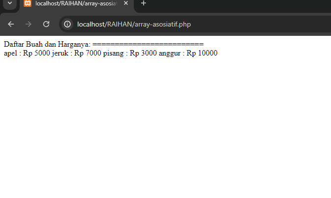
#### Analisis
1. **Mendefinisikan Array Asosiatif**: Baris pertama mendefinisikan sebuah array asosiatif dengan nama `$buah_harga`. Setiap elemen array memiliki pasangan kunci-nilai, di mana kunci adalah nama buah dan nilai adalah harga buah tersebut.
    
2. **Mencetak Informasi**: Program mencetak judul "Daftar Buah dan Harganya:" diikuti oleh garis pemisah "=========================". Ini adalah bagian dari output yang akan dicetak.
    
3. **Looping Melalui Array**: Program menggunakan loop foreach untuk mengulang melalui setiap pasangan kunci-nilai dalam array asosiatif `$buah_harga`. Pada setiap iterasi, nilai kunci disimpan dalam variabel `$nama_buah`, sedangkan nilai disimpan dalam variabel `$harga`.
    
4. **Mencetak Setiap Pasangan**: Dalam setiap iterasi, program mencetak nama buah dan harganya dengan format yang ditentukan. Nama buah diikuti oleh tanda titik dua dan harga, yang dipisahkan oleh tanda "Rp". Setiap pasangan kunci-nilai dicetak dalam baris terpisah.
    
5. **Output**: Setelah loop selesai dieksekusi, program akan mencetak daftar buah dan harganya sesuai dengan informasi yang tersedia dalam array asosiatif.
#### Kesimpulan Program
Program menggunakan array asosiatif untuk menyimpan dan mencetak daftar buah beserta harganya. Setiap buah memiliki kunci nama buah dan nilai harga buah. Dengan menggunakan loop foreach, program mencetak setiap pasangan kunci-nilai dalam format yang terstruktur. Ini memberikan cara yang efisien dan mudah dimengerti untuk mengelola informasi terkait dalam PHP.

### Array multidimensi
#### Penjelasan
Array multidimensi adalah tipe array di mana setiap elemen array juga dapat menjadi array sendiri. Ini berarti kita memiliki array dalam array. Array multidimensi digunakan untuk menyimpan data yang memiliki struktur yang lebih kompleks daripada array satu dimensi. Sebagai contoh, kita dapat menggunakan array multidimensi untuk menyimpan data tabel, matriks, atau data terstruktur lainnya.
#### Struktur
```php
$array = array(

    array(nilai1, nilai2, nilai3, ...),

    array(nilai4, nilai5, nilai6, ...),

    ...
```
#### Program
```php
$matriks = array(

    array(1, 2, 3),

    array(4, 5, 6),

    array(7, 8, 9)

);

echo $matriks[0][0]; // Output: 1

echo $matriks[1][1]; // Output: 5

echo $matriks[2][2]; // Output: 9
```
#### Hasil 
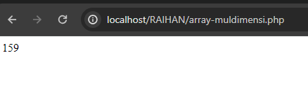
#### Analisis
Pada kode di atas, kita memiliki variabel `$matriks` yang merupakan array multidimensi dengan ukuran 3x3. Setiap elemen dalam array utama adalah array lain yang berisi tiga elemen.

- `$matriks[0][0]` mengakses elemen pertama dari array pertama dalam `$matriks`, sehingga menghasilkan output 1.
- `$matriks[1][1]` mengakses elemen kedua dari array kedua dalam `$matriks`, sehingga menghasilkan output 5.
- `$matriks[2][2]` mengakses elemen ketiga dari array ketiga dalam `$matriks`, sehingga menghasilkan output 9.
#### Kesimpulan Program
- Program tersebut menggunakan array multidimensi dalam bahasa pemrograman PHP.
- Array multidimensi digunakan untuk menyimpan data dalam bentuk matriks atau struktur data yang lebih kompleks, di mana setiap elemen dapat diakses menggunakan indeks dari array induk dan array anak.
- Program menunjukkan cara mengakses elemen-elemen spesifik dari matriks menggunakan indeks baris dan kolom.
- Contoh penggunaan dalam program menunjukkan cara mengakses elemen-elemen utama matriks, seperti elemen pertama dari setiap baris, yang merepresentasikan nilai-nilai diagonal dalam matriks.
- Array multidimensi sangat berguna dalam pemrograman untuk memanipulasi dan mengelola data yang memiliki struktur terstruktur, seperti matriks, tabel, atau kumpulan data yang terkait.

## Looping (Pembagian)

### For
#### Penjelasan
Di dalam bahasa pemrograman PHP, pernyataan `for` digunakan untuk melakukan iterasi (pengulangan) sejumlah tertentu. Ini memungkinkan Anda untuk mengeksekusi serangkaian pernyataan dengan jumlah iterasi yang telah ditentukan sebelumnya.
#### Struktur
```php
for (inisialisasi; kondisi; perubahan) {

    // blok kode yang akan diulang
```
#### Program
```php
for ($i = 1; $i <= 5; $i++) {

    echo $i;
```
#### Hasil 
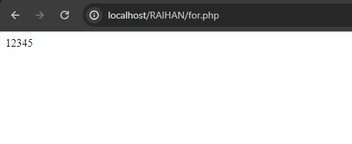
#### Analisis
1. `for ($i = 1; $i <= 5; $i++) {`: Pernyataan `for` dimulai dengan inisialisasi `$i` yang diatur ke 1. Kemudian, ada kondisi iterasi yang mengevaluasi apakah nilai `$i` kurang dari atau sama dengan 5. Jika kondisi ini terpenuhi, blok pernyataan dalam pernyataan `for` akan dieksekusi. Setelah setiap iterasi, nilai `$i` akan ditambah satu.
    
2. `echo $i;`: Pada setiap iterasi, nilai `$i` akan dicetak. Dalam contoh ini, nilai `$i` akan mencetak angka dari 1 hingga 5.
    
3. Setelah blok pernyataan dieksekusi, kendali akan kembali ke pernyataan `for`. Jika kondisi iterasi masih terpenuhi (nilai `$i` masih kurang dari atau sama dengan 5), iterasi berikutnya akan dilakukan. Jika tidak, eksekusi program akan melanjutkan ke pernyataan di luar blok `for`.
#### Kesimpulan Program
- rogram menggunakan pernyataan `for` untuk melakukan iterasi sejumlah tertentu.
- Pernyataan `for` terdiri dari tiga bagian: inisialisasi, kondisi, dan iterasi.
- Inisialisasi (`$i = 1`) menginisialisasi variabel iterasi `$i` ke nilai awal 1.
- Kondisi (`$i <= 5`) mengevaluasi apakah nilai variabel iterasi `$i` masih kurang dari atau sama dengan 5. Jika benar, iterasi akan terus dilakukan; jika tidak, iterasi berhenti.
- Iterasi (`$i++`) mengatur variabel iterasi `$i` untuk nilai berikutnya setiap kali iterasi dilakukan.
- Dalam blok pernyataan `for`, nilai variabel iterasi `$i` dicetak menggunakan `echo`.
- Setelah iterasi berakhir, eksekusi program melanjutkan ke pernyataan di luar blok `for`.
### While
#### Penjelasan
Pernyataan `while` dalam PHP digunakan untuk melakukan iterasi (pengulangan) atas serangkaian pernyataan selama kondisi tertentu terpenuhi.
#### Struktur
```php
while (kondisi) {

    // blok kode yang akan diulang

    // perubahan kondisi harus dilakukan di dalam blok kode
```
#### Program
```php
$i = 1;

while ($i <= 5) {

    echo $i;

    $i++;
```
#### Hasil 
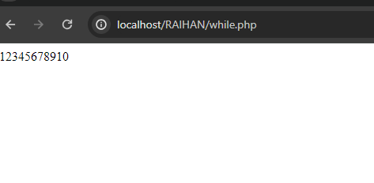
#### Analisis
1. `$i = 1;`: Variabel `$i` diinisialisasi dengan nilai 1 di luar pernyataan `while`. Ini menyiapkan variabel yang akan digunakan sebagai penghitung iterasi.
    
2. `while ($i <= 5) {`: Pernyataan `while` dimulai di sini. Kondisi iterasi adalah `$i` kurang dari atau sama dengan 5. Selama kondisi ini terpenuhi, blok pernyataan dalam pernyataan `while` akan dieksekusi. Ini berarti iterasi akan terus berlanjut selama nilai variabel `$i` kurang dari atau sama dengan 5.
    
3. `echo $i;`: Pada setiap iterasi, nilai variabel `$i` dicetak. Pada awalnya, `$i` memiliki nilai 1, kemudian akan mencetak nilai 1, 2, 3, 4, dan 5 pada setiap iterasi karena nilai `$i` akan bertambah satu setiap kali pernyataan dalam blok `while` dieksekusi.
    
4. `$i++;`: Setelah mencetak nilai `$i`, nilai variabel `$i` akan ditambah satu. Hal ini diperlukan untuk mencegah pernyataan `while` terus berjalan tanpa henti, sehingga variabel iterasi terus meningkat setiap kali iterasi dilakukan.
#### Kesimpulan Program
- Program menggunakan pernyataan `while` untuk melakukan iterasi (pengulangan) selama kondisi tertentu terpenuhi.
- Variabel `$i` diinisialisasi dengan nilai 1 di luar pernyataan `while`.
- Kondisi iterasi adalah `$i` kurang dari atau sama dengan 5. Ini berarti iterasi akan terus dilakukan selama nilai variabel `$i` kurang dari atau sama dengan 5.
- Pada setiap iterasi, nilai variabel `$i` dicetak menggunakan `echo`.
- Setelah mencetak nilai `$i`, nilai variabel `$i` ditambah satu menggunakan operator penambahan `$i++`. Ini dilakukan untuk memastikan bahwa nilai variabel iterasi terus bertambah setiap kali iterasi dilakukan, sehingga iterasi akhirnya berhenti saat nilai `$i` melebihi 5.
- Hasilnya adalah program akan mencetak angka dari 1 hingga 5 secara berurutan.
### do-while
#### Penjelasan
Pernyataan `do-while` dalam PHP mirip dengan pernyataan `while`, namun dengan perbedaan bahwa pernyataan dalam blok `do` akan dieksekusi setidaknya satu kali, bahkan jika kondisi pada awalnya salah.

Pernyataan `do-while` berguna ketika Anda ingin menjalankan blok pernyataan setidaknya sekali sebelum mengevaluasi kondisi untuk iterasi selanjutnya.
#### Struktur
```php
do {

    // blok kode yang akan diulang

    // perubahan kondisi harus dilakukan di dalam blok kode

} while (kondisi);
```
#### Program
```php
$i = 1;

do {

    echo $i;

    $i++;

} while ($i <= 5);
```
#### Hasil 
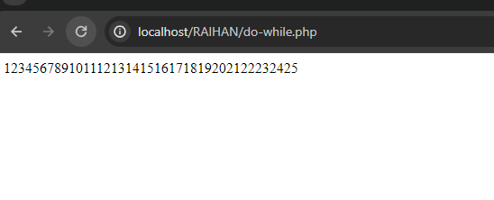
#### Analisis
1. `$i = 1;`: Variabel `$i` diinisialisasi dengan nilai 1 di luar pernyataan `do-while`. Ini menyiapkan variabel yang akan digunakan sebagai penghitung iterasi.
    
2. `do { ... }`: Ini adalah blok pernyataan yang akan dieksekusi setidaknya satu kali. Pada blok ini, kita mencetak nilai variabel `$i` menggunakan `echo`, dan kemudian nilai variabel `$i` ditambah satu.
    
3. `while ($i <= 5);`: Setelah blok pernyataan di dalam `do` selesai dieksekusi, kondisi iterasi dievaluasi. Jika kondisi (`$i <= 5`) benar, iterasi akan terus dilakukan, dan blok pernyataan dalam `do` akan dieksekusi lagi. Jika kondisi itu salah, iterasi berhenti, dan eksekusi program melanjutkan ke pernyataan setelah blok `do-while`.
#### Kesimpulan Program
- Program menggunakan pernyataan `do-while` untuk melakukan iterasi (pengulangan) setidaknya satu kali, bahkan jika kondisi pada awalnya salah.
- Variabel `$i` diinisialisasi dengan nilai 1 di luar pernyataan `do-while`.
- Blok pernyataan dalam `do` mencetak nilai variabel `$i` menggunakan `echo`, kemudian nilai variabel `$i` ditambah satu.
- Setelah blok pernyataan dalam `do` dieksekusi, kondisi iterasi (`$i <= 5`) dievaluasi. Jika kondisi ini benar, iterasi akan terus dilakukan, dan blok pernyataan dalam `do` akan dieksekusi lagi. Jika kondisi ini salah, iterasi berhenti, dan eksekusi program melanjutkan ke pernyataan setelah blok `do-while`.
- Hasilnya adalah program akan mencetak angka dari 1 hingga 5 secara berurutan karena kondisi `$i <= 5` terpenuhi. Meskipun nilai `$i` awalnya adalah 1 (dan tidak memenuhi kondisi pada awalnya), pernyataan `do-while` memastikan bahwa setidaknya satu iterasi akan dilakukan sebelum kondisi diuji kembali.
- Pernyataan `do-while` berguna ketika kita ingin menjalankan blok pernyataan setidaknya sekali sebelum mengevaluasi kondisi untuk iterasi selanjutnya.
### Foreach
#### Penjelasan
Pernyataan `foreach` dalam PHP digunakan untuk mengulang melalui setiap elemen dalam array atau objek. Ini memungkinkan Anda untuk mengakses nilai setiap elemen dalam array atau properti setiap objek secara langsung tanpa menggunakan indeks atau kunci
#### Struktur
```php
foreach ($array as $nilai) {

    // blok kode yang akan diulang

}
```
#### Program
```php
$nama = array("Rehan", "Frhan", "Ardi");

foreach ($nama as $namatrio) {

    echo $namatrio;

}
```
#### Hasil 
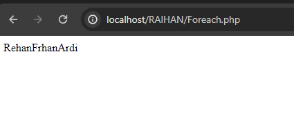
#### Analisis
1. Variabel `$nama` didefinisikan sebagai array yang berisi tiga elemen: "Rehan", "Frhan", dan "Ardi".
    
2. Pernyataan `foreach` digunakan untuk mengiterasi melalui setiap elemen dalam array `$nama`.
    
3. Pada setiap iterasi, nilai dari elemen saat ini disimpan dalam variabel `$namatrio`.
    
4. Dalam blok pernyataan `foreach`, nilai `$namatrio` dicetak menggunakan `echo`.
#### Kesimpulan Program
- Program menggunakan pernyataan `foreach` untuk mengiterasi melalui setiap elemen dalam array.
- Variabel `$nama` didefinisikan sebagai array yang berisi tiga elemen: "Rehan", "Frhan", dan "Ardi".
- Pernyataan `foreach` digunakan untuk mengiterasi melalui setiap elemen dalam array `$nama`.
- Pada setiap iterasi, nilai dari elemen saat ini disimpan dalam variabel `$namatrio`
- Dalam blok pernyataan `foreach`, nilai `$namatrio` dicetak menggunakan `echo`.
- Hasil eksekusi program ini akan mencetak semua nama yang ada dalam array `$nama`, yaitu "Rehan", "Frhan", dan "Ardi", tanpa spasi atau pemisah lain karena tidak ada karakter tambahan setelah `$namatrio` dalam pernyataan `echo`.


## Var dump

### Penjelasan
Dalam PHP, `var_dump()` adalah fungsi yang digunakan untuk menampilkan informasi mengenai variabel. Fungsi ini sangat berguna untuk debugging, karena dapat memberikan informasi rinci tentang jenis data dan nilai dari variabel apa pun.
### Struktur
```php

```
### Program
```php
<?php
$person = array(
    'nama' => 'John Doe',
    'umur' => 30,
    'email' => 'john@example.com'
);


$karyawan = array(
    array(
        'nama' => 'Alice',
        'departemen' => 'HR',
        'gaji' => 5000
    ),
);

// Menampilkan informasi array asosiatif
echo "Informasi array asosiatif:\n";
var_dump($person);
echo "\n";

// Menampilkan informasi array multidimensi
echo "Informasi array multidimensi:\n";
var_dump($karyawan);
?>

```
### Hasil

### Analisis 
- Array `$person` memiliki tiga elemen: 'nama', 'umur', dan 'email', yang masing-masing memiliki nilai berupa nama, umur, dan email seorang individu.
- Array `$karyawan` merupakan array multidimensi yang berisi satu array lagi di dalamnya. Setiap elemen array di dalam `$karyawan` mewakili seorang karyawan dan memiliki tiga elemen: 'nama', 'departemen', dan 'gaji'.

Kemudian, program ini menggunakan fungsi `var_dump()` untuk menampilkan informasi tentang kedua array tersebut. Hasil dari `var_dump()` akan menampilkan informasi tentang struktur dan nilai dari setiap elemen array, termasuk tipe data dan panjang string (jika berlaku).
### Kesimpulan Program
- Array asosiatif digunakan untuk menyimpan pasangan kunci-nilai di mana kunci adalah string dan nilainya dapat berupa tipe data apa pun.
- Array multidimensi adalah array yang berisi satu atau lebih array di dalamnya. Hal ini memungkinkan kita untuk mengatur data dalam struktur yang lebih kompleks, seperti tabel atau matriks.
- Fungsi `var_dump()` digunakan untuk menampilkan informasi rinci tentang struktur dan nilai dari variabel, termasuk array. Ini adalah alat yang sangat berguna untuk debugging dalam pengembangan PHP karena membantu kita memahami struktur data dengan lebih baik.
## Function
### Penjelasan:**
Function dalam bahasa PHP adalah blok kode yang diberi nama dan digunakan untuk menjalankan tugas tertentu. Function memungkinkan kita untuk mengorganisir kode menjadi bagian yang terpisah dan dapat digunakan kembali di berbagai bagian dalam program. Dengan menggunakan function, kita dapat mengelompokkan kode yang memiliki fungsi serupa dan mempermudah pemeliharaan dan pengembangan program.

### *Struktur:*

### Kode Program
```php
function nama_function(parameter1, parameter2, ...) {
    // Blok kode yang dijalankan ketika function dipanggil
    // ...
    return nilai;
}

*Contoh Program:*
php
function tambah($a, $b) {
    $hasil = $a + $b;
    return $hasil;
}

$angka1 = 5;
$angka2 = 3;
$hasil_penjumlahan = tambah($angka1, $angka2);

echo "Hasil penjumlahan: " . $hasil_penjumlahan;
```

### *Hasil:*
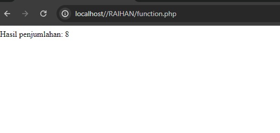
### *Analisis:*
- Dalam contoh program di atas, kita mendefinisikan sebuah function bernama tambah yang menerima dua parameter $a dan $b.
- Di dalam function tambah, kita menambahkan nilai dari parameter $a dan $b dan menyimpan hasilnya di variabel $hasil.
- Kemudian, kita mengembalikan nilai $hasil menggunakan pernyataan return.
- Di luar function, kita mendefinisikan dua variabel $angka1 dan $angka2 yang akan digunakan sebagai argumen saat memanggil function tambah.
- Hasil penjumlahan dari function tambah disimpan di variabel $hasil_penjumlahan.
- Akhirnya, kita mencetak hasil penjumlahan menggunakan pernyataan echo.
### *Kesimpulan:*
Program ini menggunakan function tambah untuk menjumlahkan dua angka dan mencetak hasilnya. Penggunaan function memungkinkan kita untuk mengorganisir kode menjadi blok yang terpisah dan dapat digunakan kembali. Keuntungan menggunakan function antara lain:
- Modularitas: Kode penjumlahan dipisahkan ke dalam function tambah, sehingga memudahkan pemeliharaan dan pengembangan kode. Jika ada perubahan pada logika penjumlahan, kita hanya perlu memodifikasi function tambah, bukan seluruh program.
- Reusabilitas: Function tambah dapat dipanggil berkali-kali dengan argumen yang berbeda. Kita dapat menggunakan kembali function ini di berbagai bagian program yang membutuhkan operasi penjumlahan.
- Keterbacaan: Penggunaan function dengan nama yang deskriptif, seperti tambah, membuat kode lebih mudah dipahami dan mempermudah pemahaman terhadap fungsi yang dilakukan oleh blok kode tersebut.

## PHP
### Get Method
#### Penjelasan
Metode GET dalam PHP adalah salah satu metode HTTP yang digunakan untuk mengirim data dari klien (browser) ke server. Data yang dikirim dengan metode GET ditambahkan ke URL sebagai parameter, yang membuatnya terlihat di address bar browser. Metode ini umumnya digunakan untuk mengambil data dari server tanpa mengubahnya, seperti saat melakukan pencarian di mesin pencari atau mengambil informasi dari database berdasarkan query.
#### Struktur
```php

```
#### Kode Program
**From get**
```php

<!DOCTYPE html>

<html lang="en">

  

<head>

    <title>Document</title>

</head>

  

<body>

    <!-- Pada atribut action, kalian tuliskan nama file php yang bertugas untuk mengelola atau menangkap data dari form tersebut. -->

    <form action="proses_get.php" method="GET">

        <input type="text" name="nama_lengkap" placeholder="Masukkan nama">

        <input type="number" name="umur" placeholder="Masukkan umur"> <br>

        <button type="submit">Kirim</button>

    </form>

</body>

  

</html>

```

**Proses get**
```php
<?php

// Key dari array-nya, sesuai dengan nama dari atribut name di setiap input-nya

$nama = $_GET["nama_lengkap"];

$umur = $_GET["umur"];

?>

  

var_dump$_GET

  

<!DOCTYPE html>

<html lang="en">

  

<head>

    <meta charset="UTF-8">

    <meta name="viewport" content="width=device-width, initial-scale=1.0">

    <title>Ariq Hikari Hidayat - XI RPL 2 - GET</title>

</head>

  

<body>

    <p>Nama anda

        <!-- Ini adalah versi singkatnya dari php echo,

             yang fungsinya untuk menampilkan data -->

        <?= $nama ?>

    </p>

    <p>Umur anda <?= $umur ?> tahun</p>

</body>

  

</html>
```

#### Hasil
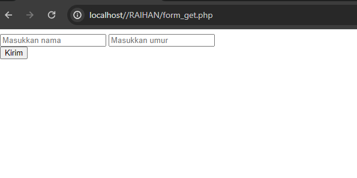

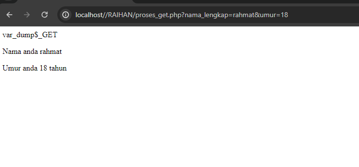

#### Analisis
- **Form**:
    - Form ini menggunakan metode GET untuk mengirim data ke `proses_get.php` ketika tombol "Kirim" diklik.
    - Input pertama adalah text input untuk memasukkan nama lengkap, dengan atribut `name="nama_lengkap"`.
    - Input kedua adalah number input untuk memasukkan umur, dengan atribut `name="umur"`.
    - Tombol submit mengirim data dari kedua input tersebut ke `proses_get.php`.


- **Mengambil Data GET**:
    
    - `$_GET["nama_lengkap"]` mengambil nilai dari parameter `nama_lengkap` yang dikirim melalui URL.
    - `$_GET["umur"]` mengambil nilai dari parameter `umur` yang dikirim melalui URL.
- **Menampilkan Isi GET**:
    
    - `var_dump($_GET)` menampilkan semua data yang diterima melalui metode GET untuk tujuan debugging. Ini akan menampilkan array asosiatif yang berisi kunci dan nilai dari data yang dikirimkan.
- **Menggunakan Data di HTML**:
    
    - Data yang diterima dari `$_GET` digunakan untuk ditampilkan di dalam HTML.
    - `<?= htmlspecialchars($nama) ?>` adalah shorthand dari `<?php echo htmlspecialchars($nama); ?>` untuk menampilkan nama yang dikirim.
    - `<?= htmlspecialchars($umur) ?>` menampilkan umur yang dikirim.
    - `htmlspecialchars()` digunakan untuk menghindari serangan XSS dengan mengonversi karakter khusus menjadi entitas HTML.


#### Kesimpulan
1. **Form HTML**:
    
    - Menggunakan metode GET untuk mengirimkan data ke `proses_get.php`.
    - Memiliki input untuk nama lengkap dan umur.
2. **Proses PHP**:
    
    - Mengambil data yang dikirim melalui URL menggunakan `$_GET`.
    - Menampilkan data yang diterima dengan `var_dump()` untuk debugging.
    - Menggunakan data tersebut untuk menampilkan pesan di halaman HTML.
3. **Keamanan**:
    
    - Menggunakan `htmlspecialchars()` untuk mencegah serangan XSS saat menampilkan data yang dikirim oleh pengguna.

### Post Method
#### Penjelasan
Metode POST adalah salah satu cara untuk mengirimkan data dari klien (seperti browser web) ke server web. Metode ini sering digunakan dalam formulir HTML ketika data perlu dikirim ke server untuk diproses, seperti dalam kasus pendaftaran pengguna, pengiriman komentar, dan sebagainya.
#### Struktur
```php

```

#### Kode Program
**Form posh
```php

<!DOCTYPE html>

<html lang="en">

  

<head>

    <title>Document</title>

</head>

  

<body>

    <!-- Pada atribut action, kalian tuliskan nama file php yang bertugas untuk mengelola atau menangkap data dari form tersebut. -->

    <form action="proses_posh.php" method="POST">

        <input type="text" name="nama_lengkap" placeholder="Masukkan nama">

        <input type="number" name="umur" placeholder="Masukkan umur">

        <input type="password" name="password" placeholder="Masukkan password"><br>

        <button type="submit">Kirim</button>

    </form>

</body>

  

</html>

```

proses posh
```php

<?php

// Key dari array-nya, sesuai dengan nama dari atribut name di setiap input-nya

//$nama = $_GET["nama"];

$umur = $_POST["umur"];

  

var_dump($_POST);

  

?>

  

<!DOCTYPE html>

<html lang="en">

  

<head>

    <title> XI RPL 1 - POST</title>

</head>

  

<body>

    <p>Nama anda <?= $_POST["nama_lengkap"] ?></p>

    <p>Umur anda <?= $umur ?> tahun</p>

    <p>Password anda aman!</p>

</body>

  

</html>

```
#### Hasil
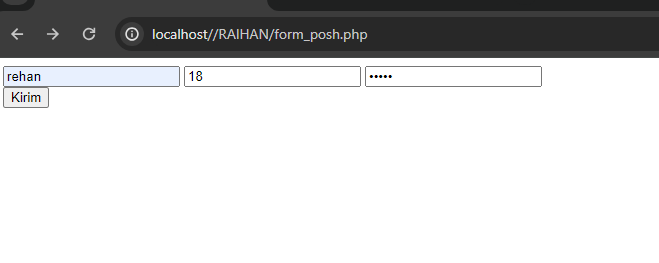

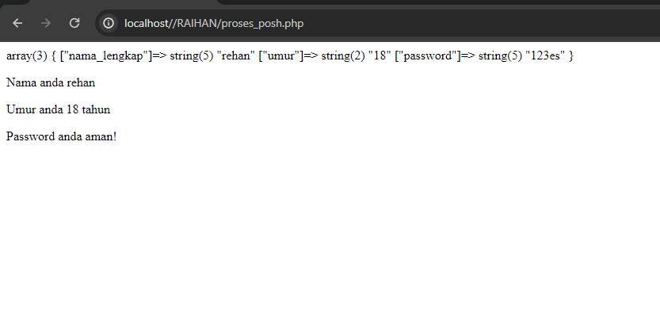
#### Analisis
- **Form**:
    - Form ini menggunakan metode POST untuk mengirim data ke `proses_posh.php` ketika tombol "Kirim" diklik.
    - Input pertama adalah text input untuk memasukkan nama lengkap, dengan atribut `name="nama_lengkap"`.
    - Input kedua adalah number input untuk memasukkan umur, dengan atribut `name="umur"`.
    - Input ketiga adalah password input untuk memasukkan kata sandi, dengan atribut `name="password"`.
    - Tombol submit mengirim data dari ketiga input tersebut ke `proses_posh.php`.


- **Mengambil Data POST**:
    
    - `$_POST["nama_lengkap"]` mengambil nilai dari parameter `nama_lengkap` yang dikirim melalui form.
    - `$_POST["umur"]` mengambil nilai dari parameter `umur` yang dikirim melalui form.
    - `$_POST["password"]` mengambil nilai dari parameter `password` yang dikirim melalui form (meskipun tidak ditampilkan dalam output).
- **Menampilkan Isi POST**:
    
    - `var_dump($_POST)` menampilkan semua data yang diterima melalui metode POST untuk tujuan debugging. Ini akan menampilkan array asosiatif yang berisi kunci dan nilai dari data yang dikirimkan.
- **Menggunakan Data di HTML**:
    
    - Data yang diterima dari `$_POST` digunakan untuk ditampilkan di dalam HTML.
    - `<?= htmlspecialchars($_POST["nama_lengkap"]) ?>` adalah shorthand dari `<?php echo htmlspecialchars($_POST["nama_lengkap"]); ?>` untuk menampilkan nama yang dikirim.
    - `<?= htmlspecialchars($umur) ?>` menampilkan umur yang dikirim.
    - `htmlspecialchars()` digunakan untuk menghindari serangan XSS dengan mengonversi karakter khusus menjadi entitas HTML.

#### Kesimpulan Program
1. **Form HTML**:
    
    - Menggunakan metode POST untuk mengirimkan data ke `proses_posh.php`.
    - Memiliki input untuk nama lengkap, umur, dan password.
2. **Proses PHP**:
    
    - Mengambil data yang dikirim melalui metode POST menggunakan `$_POST`.
    - Menampilkan data yang diterima dengan `var_dump()` untuk debugging.
    - Menggunakan data tersebut untuk menampilkan pesan di halaman HTML.
3. **Keamanan**:
    
    - Menggunakan `htmlspecialchars()` untuk mencegah serangan XSS saat menampilkan data yang dikirim oleh pengguna.
    - Menyembunyikan data sensitif (seperti password) dari tampilan.
